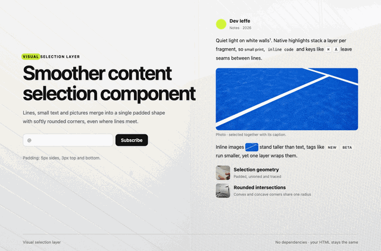

# Visual selection layer

Enhanced page content selection

<p align="center"></p>

Native text selection stacks a separate highlight for every line and element, so you get seams, overlaps and weird corners. Visual selection layer paints the whole selection as **one** smooth layer instead, with padding and rounded corners everywhere, even where lines meet. It also covers images, small print, inline code and form fields.

No dependencies, no build step, and your HTML stays the same.

The script handles all main HTML tags, but some use cases may require additional scripting or styling.

The promo website loads CodePen by default unless a saved preference disables it. UserWay waits for consent; fonts are self-hosted. Preferences can be changed in [the website Privacy modal](index.html#privacy-settings). Default CodePen loading is not a prior-consent mechanism. This website preference layer is separate from the dependency-free selection engine.

## Install (HTML)

1. Copy `html/VisualSelectionLayer.js` into your project.
2. Add it to your page:

   ```html
   <script src="VisualSelectionLayer.js"></script>
   ```

CSS: `html/VisualSelectionLayer.css`

After publishing the npm package, the script is also available through UNPKG:

```html
<link rel="stylesheet" href="https://unpkg.com/vsl@0.1.0/VisualSelectionLayer.css">
<script src="https://unpkg.com/vsl@0.1.0/VisualSelectionLayer.js"></script>
```

```css
:root {
  --selection-color: #d4f53c;
  --selection-radius: 9px;
  --selection-pad-x: 5px;
  --selection-pad-y: 3px;
  --selection-effect: fade; /* fade | blur | wipe | none */
}
```

Vars and options: `html/VisualSelectionLayer.js`.

### Handy tips

- Add `visual-selection-layer-ignore` to an element to keep the native selection there.
- Put `--selection-*` variables on any class to give that area its own look.
- Elements with `user-select: none` add no selection shape or media tint. If padding
  or a merged selection overlaps them, that part of the layer paints above them.
- JS API: `VisualSelectionLayer.enable()`, `VisualSelectionLayer.disable()`, `VisualSelectionLayer.refresh()`, and `VisualSelectionLayer.on("show" | "update" | "hide", fn)`.

## Install (React)

```bash
npm i react
```

```jsx
import VisualSelectionLayer from "./VisualSelectionLayer.js";

<VisualSelectionLayer vars={{ color: "#d4f53c", radius: "9px" }} />
```

Copy `react/VisualSelectionLayer.js` into your project. It includes the engine
and React lifecycle logic; no other local files are required.

### With GSAP

```bash
npm i gsap
```

```jsx
import gsap from "gsap";
import VisualSelectionLayerGsap from "./VisualSelectionLayerGsap.js";

<VisualSelectionLayerGsap gsap={gsap} effect="pop" /> // pop | rise | stretch
```

Copy `react/VisualSelectionLayerGsap.js` instead for the self-contained GSAP version.
Mount only one version per page. Both files also export `VisualSelectionLayerScope`
for scoped styles and native-selection opt-outs. Import components and hooks directly
from the chosen file; there are no wrapper or index files.

## Browsers

Recent Chrome, Edge, Safari & more.

## License

[PolyForm Noncommercial 1.0.0](LICENSE.md): free for personal, educational and other noncommercial use.
